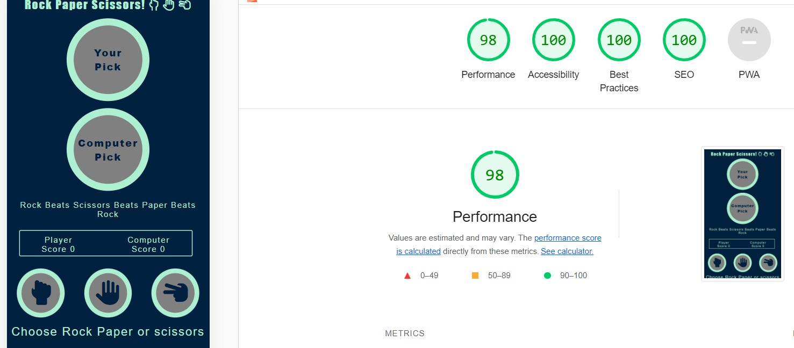

# Rock Paper scissors

I created a web app for the game rock paper scissors for my second milestone project.

![responsive] 

## Features.

### Navigation.

* 

### Front Page

* 

### Media Page

### Review page

![review]

### Footer

The footer contains links to all the films social media (Twitter, Facebook) as well as the IMDB page.

## Testing

* I tested the site worked in different browswers, eg Firefox, Edge and Chrome.

* I confirmed the site is responsive and works on all device types and in both portrait and landscape on mobile devices.

* I confirmed the links to outside sites are all correct and in working order.

* The buttons shake as intended on all device types and rapid pressing of the ssame button in succession will not break the game or affect the game counting of the score.

## Bugs

### solved

* When i first deployed the website to github pages the message displayed when a round is lost was not working. 

I realised when i had copy pasted the code from my Win message function i had neglected to change "const winMessage = winMessages[winIndex];" to loseMessages[loseIndex];. Once i made this change the function worked as intended.

## validator Testing

### HTML

The site passes through the HTML checker with no warnings or errors.

### CSS

* I ran the code through the W3C CSS Validator and it passes with no errors or warnings.

### Accessability

Running lighthouse confirmed that the colours and fonts were accesible and easy to read.

![lighthouse] 

## Deployment
The site was deployed to github pages. The steps to depoloy were as follows.

* In the Github repository navigate to the settings tab.
* From the source section drop-down menu, select the Main Branch.
* Deploy from branch.

The live link can be found here https://andrewneo82.github.io/Rock_Paper_Scissors/

## Credits   

### Content

* The code to make the buttons shake to simulate the shaking of a fist while playing rock paper scissors was taken from https://css-tricks.com/snippets/css/shake-css-keyframe-animation/.

## Media

The icons are from fontawesome.com.

